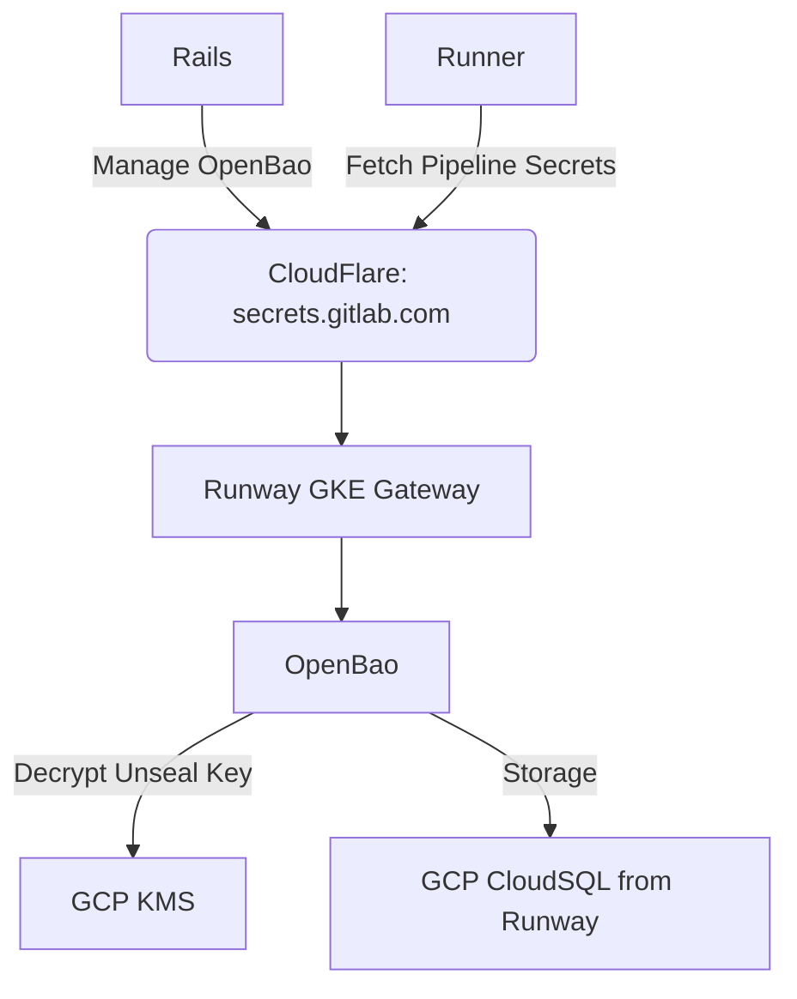
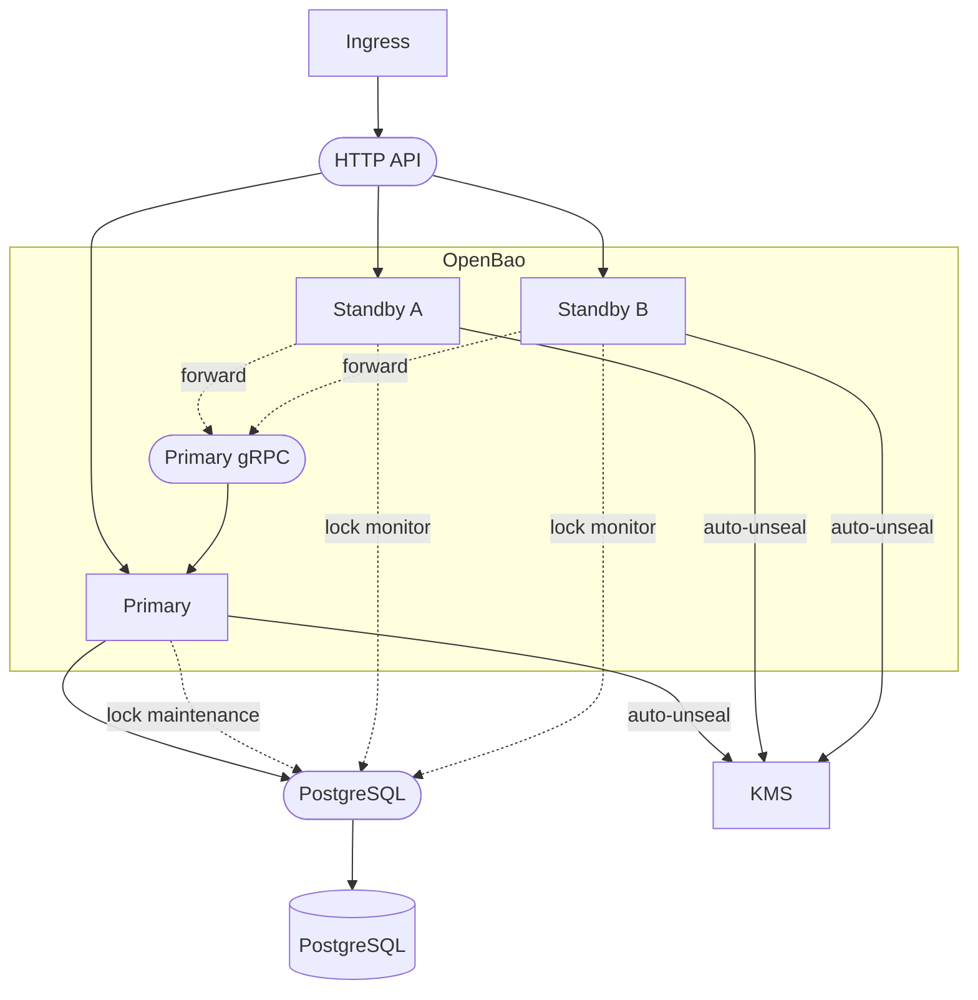

<!-- MARKER: do not edit this section directly. Edit services/service-catalog.yml then run scripts/generate-docs -->

# Secrets Manager GKE (OpenBao) Service

* [Service Overview](https://dashboards.gitlab.net/d/secrets-manager-gke-main/secrets-manager-gke3a-overview)
* **Alerts**: <https://alerts.gitlab.net/#/alerts?filter=%7Btype%3D%22secrets-manager-gke%22%2C%20tier%3D%22sv%22%7D>
* **Label**: gitlab-com/gl-infra/production~"Service::RunwayOpenBaoGKE"

## Logging

* [secrets-manager-gke (Grafana)](https://dashboards.gitlab.net/goto/afn9tfffc49a8b?orgId=1)
* [secrets-manager-gke (GCP Logs Explorer)](https://console.cloud.google.com/logs/query;query=resource.type%3D%22k8s_container%22%0Aresource.labels.container_name%3D%22app%22%0Aresource.labels.namespace_name%3D%22secrets-manager-gke%22?project=gitlab-runway-production)

<!-- END_MARKER -->

### Audit Logging

We suggest the following filters to focus on relevant project audit logs in [Grafana](https://dashboards.gitlab.net/goto/afn9urvtiwpoga?orgId=1) or [GCP Logs Explorer](https://console.cloud.google.com/logs/query;query=resource.type%3D%22k8s_container%22%0Aresource.labels.namespace_name%3D%22secrets-manager-gke%22%0Aresource.labels.container_name%3D%22app%22%0AjsonPayload.type%3D%22response%22?project=gitlab-runway-production):

```
resource.type="k8s_container"
resource.labels.namespace_name="secrets-manager-gke"
resource.labels.container_name="app"
jsonPayload.type="response"
```

OpenBao emits audit events as structured JSON on the `app` container's stdout/stderr; Cloud Logging surfaces them under `jsonPayload`.

#### Filters

* `jsonPayload.request.namespace.path="org_<org_id>/group_<root_namespace_id>/<obj_type>_<obj_id>/"` can be used to filter audit logs to a particular project or group.
  * `org_id` is the organization ID.
  * `root_namespace_id` is the ID of the top-level group.
  * `obj_type` is `group` or `project`.
  * `obj_id` is the ID of the group or project where the secrets manager lives.
  * Example: `jsonPayload.request.namespace.path="org_1/group_2377064/project_74977306/"`.
* `jsonPayload.request.path =~ "secrets/kv/data/explicit/.*"` can be used to filter to just secret _value read_ operations.
  * An explicit secret name can also be given with `jsonPayload.request.path = "secrets/kv/data/explicit/<SECRET-NAME>"`.
  * This is best used in conjunction with the above.
* `jsonPayload.auth.display_name=~"pipeline_jwt"` selects runner-initiated requests; `jsonPayload.auth.display_name=~"gitlab_rails_jwt"` selects Rails-initiated requests.

### Service Logging

We suggest the following filters to focus on service logs (non-audit) in [Grafana](https://dashboards.gitlab.net/goto/afnaova65of7kb?orgId=1) or [GCP Logs Explorer](https://console.cloud.google.com/logs/query;query=resource.type%3D%22k8s_container%22%0Aresource.labels.namespace_name%3D%22secrets-manager-gke%22%0Aresource.labels.container_name%3D%22app%22%0A-jsonPayload.request.remote_address%3A%2A?project=gitlab-runway-production):

```
resource.type="k8s_container"
resource.labels.namespace_name="secrets-manager-gke"
resource.labels.container_name="app"
-jsonPayload.request.remote_address:*
```

OpenBao writes all output (including audit events) to stderr on GKE, so GCP marks every log entry with `ERROR` severity regardless of the `[INFO]`/`[WARN]` level inside the message body. Treat the level inside the message as authoritative.

### Load balancer logs

Rails and runners reach OpenBao through CloudFlare and the Runway-managed GKE Gateway, which is backed by a Google Cloud external HTTP load balancer (see [Architecture](#architecture)).
The load balancer logs show which requests reached the Gateway and how it responded.
They help separate an edge, routing, or timeout problem at the load balancer from a problem inside OpenBao.
Filter on the forwarding rule for this service in [GCP Logs Explorer](https://console.cloud.google.com/logs/query;query=resource.type%3D%22http_load_balancer%22%0Aresource.labels.forwarding_rule_name%3D%22gkegw1-ltbu-secrets-manager-gke-secrets-manager-gk-7yxpw13bbomy%22;timeRange=PT24H?project=gitlab-runway-production):

```config
resource.type="http_load_balancer"
resource.labels.forwarding_rule_name="gkegw1-ltbu-secrets-manager-gke-secrets-manager-gk-7yxpw13bbomy"
```

The forwarding rule name is per environment.

* Production is `gkegw1-ltbu-secrets-manager-gke-secrets-manager-gk-7yxpw13bbomy` in the `gitlab-runway-production` project.
* Staging is `gkegw1-l52v-secrets-manager-gke-secrets-manager-gk-6w373ljxugpk` in the `gitlab-runway-staging` project.

Useful fields on each entry:

* `httpRequest.status` is the HTTP status the load balancer returned.
* `httpRequest.requestUrl` includes the OpenBao path, so the tenant namespace is visible, for example `org_1/group_<id>/project_<id>/secrets/kv/data/explicit/<name>`.
* `httpRequest.latency` is the round-trip time. A value near `30s` on a `504` is the load balancer's backend timeout.
* `httpRequest.remoteIp` is CloudFlare's edge address, not the runner or Rails. All traffic arrives through CloudFlare, so the originating client is not visible here.
* `jsonPayload.statusDetails` is a string value that explains the outcome at the load balancer.
* `jsonPayload.enforcedSecurityPolicy.outcome` is `ACCEPT` when the `cloudflare-ingress-only-policy` edge policy allowed the request.

The value of `statusDetails` is one of the following strings, paired with the HTTP code in `httpRequest.status`:

* `response_sent_by_backend` is the normal case, where OpenBao answered. Any `5xx` here came from OpenBao itself, so check [Error logs](#error-logs).
* `backend_timeout` accompanies a `504` after the backend does not respond within the load balancer's timeout (about `30s`). This is the signature of a slow or blocked OpenBao request. Check the OpenBao service logs for the same path and time.
* `failed_to_pick_backend` accompanies a `503` when there is no healthy backend to route to. Check pod health.

### Openbao Caller Logs

When debugging a Secrets Manager incident, it is useful to check the caller side to see what was sent to OpenBao

#### Rails web

Create, update and delete operations Secrets and associated Permissions, use [Kibana](https://log.gprd.gitlab.net/app/discover#/?_g=%28time%3A%28from%3Anow-3h%2Cto%3Anow%29%29&_a=%28columns%3A%21%28%27json.correlation_id%27%2C%27json.status%27%2C%27json.path%27%2C%27json.meta.caller_id%27%2C%27json.meta.user%27%2C%27json.exception.message%27%29%2Cindex%3A%2747fcde5c-0c9e-4c10-ba6f-8767d1155d18%27%2Cinterval%3Aauto%2Cquery%3A%28language%3Akuery%2Cquery%3A%27json.controller%20%3A%20%28%22Projects%3A%3ASecretsController%22%20or%20%22Groups%3A%3ASecretsController%22%29%20or%20json.meta.caller_id%20%3A%20graphql%5C%3A%2ASecret%2A%20or%20json.path%20%3A%20%22%2Fapi%2Fv4%2Finternal%2Fsecrets_manager%2Faudit_logs%22%27%29%2Csort%3A%21%28%27%40timestamp%27%2Cdesc%29%29) — data view `pubsub-rails-inf-gprd-*`:

```
json.controller : ("Projects::SecretsController" or "Groups::SecretsController") or json.meta.caller_id : graphql\:*Secret* or json.path : "/api/v4/internal/secrets_manager/audit_logs"
```

Three OR clauses cover the user-facing surfaces: HTML UI controllers, GraphQL mutations and resolvers, and the OpenBao→Rails audit callback Grape endpoint. The filter excludes other code declaring `feature_category :secrets_management` (CI Secure Files, CI job-token logging) which are unrelated to OpenBao Secrets Manager.

#### Sidekiq

Provisioning, deprovisioning, and rotation reminder workers — all under the `SecretsManagement::*` namespace. Use [Kibana](https://log.gprd.gitlab.net/app/discover#/?_g=%28time%3A%28from%3Anow-3h%2Cto%3Anow%29%29&_a=%28columns%3A%21%28%27json.correlation_id%27%2C%27json.class%27%2C%27json.message%27%2C%27json.jid%27%2C%27json.args%27%2C%27json.duration_s%27%2C%27json.exception.message%27%29%2Cindex%3A%27AWNABDRwNDuQHTm2tH6l%27%2Cinterval%3Aauto%2Cquery%3A%28language%3Akuery%2Cquery%3A%27json.class%20%3A%20%22SecretsManagement%3A%3A%2A%22%27%29%2Csort%3A%21%28%27%40timestamp%27%2Cdesc%29%29) — data view `pubsub-sidekiq-inf-gprd-*`:

```
json.class : "SecretsManagement::*"
```

#### Runner

gitlab.com Shared Runners. Use [Kibana](https://log.gprd.gitlab.net/app/discover#/?_g=%28time%3A%28from%3Anow-3h%2Cto%3Anow%29%29&_a=%28columns%3A%21%28%27json.correlation_id%27%2C%27json.msg%27%2C%27json.job%27%2C%27json.runner%27%2C%27json.project%27%2C%27json.error%27%29%2Cindex%3A%27pubsub-runner-inf-gprd%27%2Cinterval%3Aauto%2Cquery%3A%28language%3Akuery%2Cquery%3A%27json.msg%20%3A%20%28%22resolving%20secrets%22%20or%20%22reading%20from%20Vault%22%20or%20%22creating%20vault%20client%22%20or%20%22inline%20auth%20JWT%22%29%27%29%2Csort%3A%21%28%27%40timestamp%27%2Cdesc%29%29) — data view `pubsub-runner-inf-gprd`:

```
json.msg : ("resolving secrets" or "reading from Vault" or "creating vault client" or "inline auth JWT")
```

Narrow with `json.job : <job_id>` or `json.runner : <runner_id>` once the affected job or runner is identified. `json.correlation_id` is often empty on runner-side Vault errors (the Vault SDK emits them outside any request context) — cross-trace to Rails/Sidekiq via `json.job` + timestamp instead.

### Checking pod health

Read node health from a few startup log lines and cross-reference the metrics.
The queries below target the `app` service logs.

#### Is a node unsealed?

At startup, a healthy pod logs `core: vault is unsealed` then `core: unsealed with stored key`, which confirms GCP KMS auto-unseal. [Open in GCP Logs Explorer](https://console.cloud.google.com/logs/query;query=resource.type%3D%22k8s_container%22%0Aresource.labels.namespace_name%3D%22secrets-manager-gke%22%0Aresource.labels.container_name%3D%22app%22%0AtextPayload%3A%22core%3A%20vault%20is%20unsealed%22;timeRange=PT24H?project=gitlab-runway-production):

```config
resource.type="k8s_container"
resource.labels.namespace_name="secrets-manager-gke"
resource.labels.container_name="app"
textPayload:"core: vault is unsealed"
```

For the current state, check the [`secrets_manager_gke_core_unsealed`](#metrics) metric.
A `0` on any pod means a KMS or unseal problem.

A pod that fails to unseal logs `core: vault is sealed` and never reaches `core: post-unseal setup complete` ([search for the sealed line](https://console.cloud.google.com/logs/query;query=resource.type%3D%22k8s_container%22%0Aresource.labels.namespace_name%3D%22secrets-manager-gke%22%0Aresource.labels.container_name%3D%22app%22%0AtextPayload%3A%22core%3A%20vault%20is%20sealed%22;timeRange=PT24H?project=gitlab-runway-production)).
See the [Pod sealed at startup](#pod-sealed-at-startup) playbook.

#### Is a node active or on standby?

Exactly one pod should be active.
Every pod logs `core: entering standby mode` first.
The pod that wins the PostgreSQL HA lock then logs `core: acquired lock, enabling active operation`.
[Open in GCP Logs Explorer](https://console.cloud.google.com/logs/query;query=resource.type%3D%22k8s_container%22%0Aresource.labels.namespace_name%3D%22secrets-manager-gke%22%0Aresource.labels.container_name%3D%22app%22%0AtextPayload%3D~%22acquired%20lock%2C%20enabling%20active%20operation%7Centering%20standby%20mode%22;timeRange=PT24H?project=gitlab-runway-production):

```config
resource.type="k8s_container"
resource.labels.namespace_name="secrets-manager-gke"
resource.labels.container_name="app"
textPayload=~"acquired lock, enabling active operation|entering standby mode"
```

The [`secrets_manager_gke_core_active`](#metrics) metric should be `1` on exactly one pod.
Zero or two active pods means HA-lock churn.
See [Leadership lost or failover](#leadership-lost-or-failover).
A standby node stays at `core: entering standby mode` and answers `/v1/sys/health` with `429`, which is expected (see [Healthy startup baseline](#healthy-startup-baseline)).

#### Finding errors in a time window

Filter on the in-message level, because Cloud Logging tags every line `ERROR`.
The query returns body-level `[ERROR]` and `[WARN]` lines and excludes audit events.
Set the window with the time-range picker.
[Open in GCP Logs Explorer (last 24h)](https://console.cloud.google.com/logs/query;query=resource.type%3D%22k8s_container%22%0Aresource.labels.namespace_name%3D%22secrets-manager-gke%22%0Aresource.labels.container_name%3D%22app%22%0A-jsonPayload.request.remote_address%3A%2A%0AtextPayload%3D~%22%5C%5BERROR%5C%5D%7C%5C%5BWARN%5C%5D%22;timeRange=PT24H?project=gitlab-runway-production):

```config
resource.type="k8s_container"
resource.labels.namespace_name="secrets-manager-gke"
resource.labels.container_name="app"
-jsonPayload.request.remote_address:*
textPayload=~"\[ERROR\]|\[WARN\]"
```

To narrow to a keyword, replace the `textPayload` clause, for example `textPayload:"failed to acquire lock"`.
The `no recovery key found` WARN is non-fatal (see [Healthy startup baseline](#healthy-startup-baseline)).

#### Finding the startup sequence and version

A pod's startup begins with the `==> OpenBao server configuration:` banner and `==> OpenBao server started!`, then follows the [healthy startup baseline](#healthy-startup-baseline).
To isolate one revision's logs, filter on the Helm chart version label and swap in the deployed version:

```config
resource.type="k8s_container"
resource.labels.namespace_name="secrets-manager-gke"
resource.labels.container_name="app"
-jsonPayload.request.remote_address:*
labels."k8s-pod/helm_sh/chart"="secrets-manager-gke-1.5.1"
```

The banner reports the exact build:

```
Version: OpenBao v2.5.2+v2.5.2-gitlab1, built 2026-04-22T15:17:27Z
Version Sha: 42f8b5aab6ac68424c0e9f96031759f9395c4832+932fcf892eba8d646a9bfc58a59ea3b2475b17fa
```

Both audit devices register during post-unseal.
Look for the two `core: enabled audit backend` lines, `path=stdout/ type=file` and `path=remote/ type=http`.

#### Healthy startup baseline

On a healthy boot, the active pod emits this sequence in the `app` container.
A standby follows the same path up to `core: entering standby mode` and stops there.

```
==> OpenBao server started! Log data will stream in below:
[INFO]  core: vault is unsealed
[INFO]  core: unsealed with stored key
[INFO]  core: entering standby mode
[INFO]  core: acquired lock, enabling active operation
[INFO]  core: enabled audit backend: path=stdout/ type=file
[INFO]  core: enabled audit backend: path=remote/ type=http
[WARN]  core: post-unseal upgrade seal keys failed: error="no recovery key found"
[INFO]  core: post-unseal setup complete
```

* `core: unsealed with stored key` (alongside `core: vault is unsealed`) confirms KMS auto-unseal succeeded.
* Every pod logs `core: entering standby mode` first. The pod that wins the PostgreSQL HA lock then logs `core: acquired lock, enabling active operation`. The standby stays in standby and never runs post-unseal.
* `core: post-unseal setup complete` is the active pod's ready-to-serve signal. The standby never logs that line.
* The two `enabled audit backend` lines confirm both devices: `file` to Cloud Logging, `http` to Rails (see [Architecture](#architecture)).
* `[WARN] core: post-unseal upgrade seal keys failed: error="no recovery key found"` is non-fatal. No recovery key is stored yet because the cluster was initialized with `recovery_shares=0`, so the warning logs on every boot and the node still reaches `post-unseal setup complete`. [production#21589](https://gitlab.com/gitlab-com/gl-infra/production/-/work_items/21589) tracks recovery key generation and storage.
* A standby answers `/v1/sys/health` with `429` (sealed `503`, active `200`). Probes use `?standbyok=true`, so a standby's `429` counts as healthy.

### Deployment logs

A deploy changes the image SHA.
The chart's image tag is the released commit's short Git SHA (see [Architecture](#architecture)).
Flux applies the new manifest and Kubernetes rolls the pods.
A new pod starts and unseals, then the active role transfers when the old pod releases its HA lock.

| Container         | Revision | Message                                                                | Explanation                                                                    | Action needed                                                                                                                                          |
|-------------------|----------|------------------------------------------------------------------------|--------------------------------------------------------------------------------|--------------------------------------------------------------------------------------------------------------------------------------------------------|
| `app`             | new      | `core: vault is unsealed` and `core: unsealed with stored key`         | New pod booted and KMS-unsealed                                                | None                                                                                                                                                   |
| `app`             | new      | `core: acquired lock, enabling active operation`                       | New pod took over as active                                                    | Confirm exactly one active pod via `core_active`                                                                                                       |
| `app`             | old      | `core: vault is sealed`                                                | Outgoing pod sealing as it shuts down                                          | Expected during rollover                                                                                                                               |
| `cloud-sql-proxy` | new      | `The proxy has started successfully and is ready for new connections!` | Database proxy ready on `127.0.0.1:5432`                                       | If absent, `app` cannot reach PostgreSQL                                                                                                               |
| pod event         | new      | `ImagePullBackOff`                                                     | kubelet cannot pull the new image SHA (registry auth, or image not yet pushed) | Shows in pod events and Flux, not `app` logs. Check `kubectl describe pod` and `flux get sources oci` on VPN. Usually clears after the image is pushed |

## Summary

[GitLab Secrets Manager](https://docs.gitlab.com/ci/secrets/secrets_manager/) is a built-in secrets management solution for CI pipelines.
Secrets are created and managed using GitLab UI, and consumed by CI jobs.

GitLab Secrets Manager relies on the `secrets-manager-gke` Runway service.
The service is configured and deployed using the
[secrets-manager-runway](https://gitlab.com/gitlab-org/govern/secrets-management/secrets-manager-runway) project.

`secrets-manager-gke` runs [OpenBao](https://openbao.org/), which is a fork of [HashiCorp Vault](https://developer.hashicorp.com/vault).
The source code of OpenBao lives in
[openbao-internal](https://gitlab.com/gitlab-org/govern/secrets-management/openbao-internal),
a build project that is intended to modify the upstream OpenBao releases.

## Architecture

The Rails backend and runners connect to the `secrets-manager-gke` service (running OpenBao)
through the CloudFlare WAF and the Runway-managed GKE Gateway.
Both Rails and runners use the same external URL (`https://secrets.gitlab.com`); there is no separate internal Runway URL on GKE.

OpenBao stores data on the Cloud SQL instance provided by Runway,
and gets the unseal key from Google KMS via GCP Workload Identity (no Vault secret is needed for KMS auth on GKE).

OpenBao is configured with two audit devices that fan out every audit event in parallel:

* `file` device writing JSON to the `app` container's stdout (surfaced in Cloud Logging — see the [Audit Logging](#audit-logging) section)
* `http` device POSTing the same events to the Rails backend at `https://gitlab.com/api/v4/internal/secrets_manager/audit_logs`

The GitLab Secrets Manager [design docs](https://handbook.gitlab.com/handbook/engineering/architecture/design-documents/secret_manager/)
provides [request flow diagrams](https://handbook.gitlab.com/handbook/engineering/architecture/design-documents/secret_manager/decisions/009_request_flows/).



The service runs multiple OpenBao pods:

* a single active pod
* one or more standby pods

Pods connect to the PostgreSQL backend to store data and to acquire a lock.

On GKE, pods coordinate directly via cluster port 8201 (pod-to-pod, no LB involvement).



## Performance

Benchmarking and sizing recommendations are covered by [gitlab#589411](https://gitlab.com/gitlab-org/gitlab/-/work_items/589411).

## Scalability

The service is deployed on Runway GKE.
Replicas are fixed at `min_instances: 2` / `max_instances: 2` — no autoscaling.
Two pods provide HA: one active and one standby, coordinating leadership via the PostgreSQL lock.

Scalability is configured in [`default-values.yaml`](https://gitlab.com/gitlab-org/govern/secrets-management/secrets-manager-runway/-/blob/main/.runway/secrets-manager-gke/default-values.yaml).

## Availability

GitLab Secrets Manager is limited to the Premium and Ultimate tiers. The feature needs to be [enabled](https://docs.gitlab.com/ci/secrets/secrets_manager/#enable-gitlab-secrets-manager) in a group or project.

The service is currently deployed in a single region: `us-east1` (both staging and production).
Per-environment Runway configuration lives in [`gke-service-staging.yaml`](https://gitlab.com/gitlab-org/govern/secrets-management/secrets-manager-runway/-/blob/main/.runway/secrets-manager-gke/gke-service-staging.yaml) and [`gke-service-production.yaml`](https://gitlab.com/gitlab-org/govern/secrets-management/secrets-manager-runway/-/blob/main/.runway/secrets-manager-gke/gke-service-production.yaml).

## Durability

Runway provisions and manages the Cloud SQL instance backing OpenBao.
On Runway GKE, [backups are always on](https://docs.runway.gitlab.com/runtimes/kubernetes/managed-services/cloudsql/) for the Cloud SQL instance.

Runway performs backup and backup restore validation as [configured](https://gitlab.com/gitlab-com/gl-infra/platform/runway/provisioner/-/blob/62918725ad9dcd8ef55d36bc5c7ee806d464d7e0/config/runtimes/gke/cloud-sql/managed.yml#L30-64) for the `secrets-manager-gke` service. See the Runway [restore validation](https://docs.runway.gitlab.com/runtimes/kubernetes/managed-services/cloudsql/#restore-validation) documentation for details.

Backup procedure:

1. Back up the Cloud SQL PostgreSQL database (`runway-db-secrets-manager-gke`).
1. Back up the unseal key material stored on Google Cloud KMS.
See [runbooks for our internal Vault service](https://gitlab.com/gitlab-com/runbooks/-/blob/master/docs/vault/vault.md#restoring-vault-from-a-snapshot-into-an-empty-installation), which similarly relies on Google Cloud KMS.

For restore, we suggest the following steps:

1. Scale OpenBao down to zero pods.
1. Perform the PostgreSQL restore.
1. Scale OpenBao back up.

## Security/Compliance

The Cloud SQL PostgreSQL database only contains encrypted data, and the unseal key is stored on Google KMS.

On Runway GKE, KMS authentication uses GCP Workload Identity tied to the pod's Kubernetes service account — there is no long-lived credential or Vault secret for KMS access.

## Monitoring/Alerting

The service comes with built-in [Runway observability](https://docs.runway.gitlab.com/reference/observability/):

* [secrets-manager-gke dashboard](https://dashboards.gitlab.net/d/secrets-manager-gke-main/secrets-manager-gke3a-overview?var-environment=production)
* [`runway-db-secrets-manager-gke` runbook](https://runbooks.gitlab.com/runway-db-secrets-manager-gke/) — dashboard, alerts, and logs for the Cloud SQL instance

## Metrics

The service comes with built-in Runway metrics.
Additionally, the OpenBao container exposes its own metrics.

OpenBao metrics for this service use the `secrets_manager_gke` prefix.

**Note:** SLIs and alerts for `secrets-manager-gke` are currently driven by Runway load-balancer metrics only (see [`metrics-catalog/services/secrets-manager-gke.jsonnet`](https://gitlab.com/gitlab-com/runbooks/-/blob/master/metrics-catalog/services/secrets-manager-gke.jsonnet)).

The `secrets_manager_gke_*` metrics are emitted by the OpenBao container and can be queried directly in Mimir, but they are not bound to any SLI for this service.
To chart one in the browser, open [Grafana Explore](https://dashboards.gitlab.net/explore?schemaVersion=1&panes=%7B%22sm%22:%7B%22datasource%22:%22mimir-runway%22,%22queries%22:%5B%7B%22refId%22:%22A%22,%22expr%22:%22secrets_manager_gke_core_unsealed%22,%22range%22:true,%22instant%22:true,%22datasource%22:%7B%22type%22:%22prometheus%22,%22uid%22:%22mimir-runway%22%7D,%22editorMode%22:%22code%22,%22legendFormat%22:%22__auto%22%7D%5D,%22range%22:%7B%22from%22:%22now-6h%22,%22to%22:%22now%22%7D%7D%7D&orgId=1) on the `mimir-runway` datasource and replace the `secrets_manager_gke_core_unsealed` expression with any metric in the table.
To scope to an environment, add `{environment="gprd"}` or `{environment="gstg"}`.

See [OpenBao telemetry docs](https://openbao.org/docs/internals/telemetry/metrics/all/) for the full list.
The table below lists the metrics most relevant for operating the service.

| Metric | Description |
| ------ | ----------- |
| [`secrets_manager_gke_audit_log_request_failure`](https://openbao.org/docs/internals/telemetry/metrics/all/#vault-audit-log_request_failure) | Number of audit log request failures |
| [`secrets_manager_gke_audit_device_log_response_failure`](https://openbao.org/docs/internals/telemetry/metrics/all/#vault-audit-device-log_response_failure) | Number of audit log response failures |
| [`secrets_manager_gke_barrier_delete`](https://openbao.org/docs/internals/telemetry/metrics/all/#vault-barrier-delete) | Time taken to delete an entry from the barrier |
| [`secrets_manager_gke_barrier_get`](https://openbao.org/docs/internals/telemetry/metrics/all/#vault-barrier-get) | Time taken to get an entry from the barrier |
| [`secrets_manager_gke_barrier_list`](https://openbao.org/docs/internals/telemetry/metrics/all/#vault-barrier-list) | Time taken to list entries in the barrier |
| [`secrets_manager_gke_barrier_put`](https://openbao.org/docs/internals/telemetry/metrics/all/#vault-barrier-put) | Time taken to put an entry in the barrier |
| [`secrets_manager_gke_cache_delete`](https://openbao.org/docs/internals/telemetry/metrics/all/#vault-cache-delete) | Number of delete operations on the cache |
| [`secrets_manager_gke_cache_hit`](https://openbao.org/docs/internals/telemetry/metrics/all/#vault-cache-hit) | Number of cache hits |
| [`secrets_manager_gke_cache_miss`](https://openbao.org/docs/internals/telemetry/metrics/all/#vault-cache-miss) | Number of cache misses |
| [`secrets_manager_gke_cache_write`](https://openbao.org/docs/internals/telemetry/metrics/all/#vault-cache-write) | Number of cache writes |
| [`secrets_manager_gke_core_active`](https://openbao.org/docs/internals/telemetry/metrics/all/#vault-core-active) | Whether the node is active (1) or standby (0) |
| [`secrets_manager_gke_core_unsealed`](https://openbao.org/docs/internals/telemetry/metrics/all/#vault-core-unsealed) | Whether the node is unsealed (1) or sealed (0) |
| [`secrets_manager_gke_core_leadership_lost`](https://openbao.org/docs/internals/telemetry/metrics/all/#vault-core-leadership_lost) | Number of times leadership was lost |
| [`secrets_manager_gke_core_leadership_setup_failed`](https://openbao.org/docs/internals/telemetry/metrics/all/#vault-core-leadership_setup_failed) | Number of times leadership setup failed |
| [`secrets_manager_gke_core_in_flight_requests`](https://openbao.org/docs/internals/telemetry/metrics/all/#vault-core-in_flight_requests) | Number of concurrent requests currently being processed |
| [`secrets_manager_gke_rollback_inflight`](https://openbao.org/docs/internals/telemetry/metrics/all/#vault-rollback-inflight) | Number of rollback operations currently in flight |
| [`secrets_manager_gke_postgres_delete`](https://openbao.org/docs/internals/telemetry/metrics/all/#vault-postgresql-delete) | Time taken to delete an entry from the PostgreSQL storage backend |
| [`secrets_manager_gke_postgres_get`](https://openbao.org/docs/internals/telemetry/metrics/all/#vault-postgresql-get) | Time taken to get an entry from the PostgreSQL storage backend |
| [`secrets_manager_gke_postgres_list`](https://openbao.org/docs/internals/telemetry/metrics/all/#vault-postgresql-list) | Time taken to list entries in the PostgreSQL storage backend |
| [`secrets_manager_gke_postgres_put`](https://openbao.org/docs/internals/telemetry/metrics/all/#vault-postgresql-put) | Time taken to put an entry in the PostgreSQL storage backend |
| [`secrets_manager_gke_runtime_alloc_bytes`](https://openbao.org/docs/internals/telemetry/metrics/all/#vault-runtime-alloc_bytes) | Number of bytes allocated by the OpenBao process |

**Notes:**

* Barrier and PostgreSQL metrics are `summary` metrics, exposing `_count`, `_sum`, and quantile series (0.5, 0.9, 0.99).
* PostgreSQL metrics are named `postgres` (not `postgresql`) in the telemetry output, despite the documentation listing them as `postgresql`.
* OpenBao is configured to exclude high-cardinality metrics.

**Excluded metrics:**

* `usage_gauge_period` is set to `0` to exclude the following metrics:
  * `token.count`
  * `token.count.by_policy`
  * `token.count.by_auth`
  * `token.count.by_ttl`
  * `expire.leases.by_expiration`
  * `secret.kv.count`
  * `identity.entity.count`
  * `identity.entity.alias.count`
* `prefix_filter` is set to exclude the following metrics:
  * `audit.*` — excluded except for `audit.log_request_failure`, `audit.log_request`, `audit.log_response_failure`, and `audit.log_response`
  * `rollback.attempt.*` — per-mount rollback counters
  * `route.*` — per-route request timers

## Troubleshooting

### Error logs

Production normally has no body-level `[ERROR]` lines.
The error signatures below indicate when something breaks.

| Container | Error message | Explanation | Action needed |
| --------- | ------------- | ----------- | ------------- |
| `app` | `[WARN] core: post-unseal upgrade seal keys failed: error="no recovery key found"` | Non-fatal. No recovery key is stored yet (initialized with `recovery_shares=0`). Logs on every boot. | Generate and store the recovery keys. See [production#21589](https://gitlab.com/gitlab-com/gl-infra/production/-/work_items/21589). |
| caller | `Failed to authenticate with OpenBao` | The JWT GitLab presented was rejected because of an OIDC issuer, `aud`, `bound_audiences`, or role mismatch | Check the caller logs ([Rails web](#rails-web) or [Runner](#runner)) and the [audit log](#audit-logging). Verify the JWT `aud` matches the role's `bound_audiences`. |
| `app` | KMS or seal errors at startup. Pod stays at `core: vault is sealed`, never logs `post-unseal setup complete`, and `core_unsealed` is `0`. | GCP KMS auto-unseal failed (KMS unreachable, or a key or workload-identity permission issue) | See [Pod sealed at startup](#pod-sealed-at-startup) |
| `app` | HA-lock or leadership errors such as `failed to acquire lock`, with [`core_leadership_lost`](#metrics) and [`core_leadership_setup_failed`](#metrics) rising and `core_active` not exactly one | HA-lock contention, or database connectivity affecting the lock | See [Leadership lost or failover](#leadership-lost-or-failover) |
| `app` | PostgreSQL connection or timeout errors in service logs, with rising [`postgres_*`](#metrics) latency | Cloud SQL connectivity or saturation | See [Cloud SQL connection or latency](#cloud-sql-connection-or-latency) |
| Rails | `401 Unauthorized` on `POST /api/v4/internal/secrets_manager/audit_logs`, with [`audit_log_request_failure`](#metrics) rising | The `http` audit device's shared token does not match the token Rails expects (`Gitlab-Openbao-Auth-Token`) | See [Audit events not reaching Rails](#audit-events-not-reaching-rails) |

### Incident playbooks

Each playbook below pairs a symptom with where to look and what to do.
Metric names omit the `secrets_manager_gke_` prefix (see [Metrics](#metrics)).

#### Provisioning or deprovisioning stuck

A secrets manager stays in `provisioning` and you cannot create secrets.
Check [Sidekiq](#sidekiq) logs for `SecretsManagement::*` and find the failing worker (`ProvisionProjectSecretsManagerWorker` or `ProvisionGroupSecretsManagerWorker`) and its `json.exception.message`.
There is no `failed` state, so a stuck record stays `provisioning`.
The maintenance cron retries the task up to three times (`Retrying failed secrets_manager maintenance task`), then gives up.

Fix the worker error, then re-trigger provisioning.
If every tenant is affected rather than one, suspect a failed OpenBao self-init instead.
See [Self-init failed](#self-init-failed).

#### Pod sealed at startup

A pod never serves when the `core_unsealed` metric is `0`, `core: post-unseal setup complete` is missing, and `core: vault is sealed` appears with KMS or seal errors in the service logs.
Verify GCP KMS reachability and the workload-identity permission on the unseal key (`gitlab-sm-prod-unseal` in `gitlab-secrets-unseal-prod`).

#### Self-init failed

OpenBao self-initializes only once, on the very first boot of a fresh install with an empty database.
It never self-initializes on restarts or upgrades.

On that first boot, OpenBao creates the global JWT auth mount and logs `core: enabled credential backend: namespace="" path=gitlab_rails_jwt/ type=jwt`.
Every later boot (restart, upgrade, or new pod) loads the existing mount and logs `core: successfully mounted: type=jwt ... path=gitlab_rails_jwt/` instead.
If neither line appears, self-init did not complete.
Rails then cannot authenticate to OpenBao, every auth call returns HTTP `401`, and the service is down for all tenants.

Check the [startup sequence](#finding-the-startup-sequence-and-version) and escalate.
This is a service-wide issue, not a single-tenant one ([gitlab#592186](https://gitlab.com/gitlab-org/gitlab/-/work_items/592186)).

#### Audit events not reaching Rails

Audit events show in Cloud Logging (the `file` device) but are missing in GitLab, and the `audit_log_request_failure` metric rises.
Check the `http` audit device in the service logs and the [Rails web](#rails-web) audit callback (`/api/v4/internal/secrets_manager/audit_logs`).
A `401` means the shared audit token mismatches.

Terraform generates the token in config-mgmt and writes it to two Vault paths with independent version counters.
OpenBao reads `runway/env/<env>/service/secrets-manager-gke/openbao-audit-token`, injected as the `GITLAB_OPENBAO_AUDIT_TOKEN` environment variable and version-pinned in [`gke-service-<env>.yaml`](https://gitlab.com/gitlab-org/govern/secrets-management/secrets-manager-runway/-/tree/main/.runway/secrets-manager-gke).
Rails reads `env/<env>/ns/gitlab/openbao/audit:token`, mounted from the `gitlab-openbao-audit-secret` ExternalSecret and version-pinned in `k8s-workloads/gitlab-com`.
A `401` usually means the two pins drifted.

Confirm the live versions with `vault kv metadata get <path>` and align both.
To rotate, regenerate the token in config-mgmt, then bump the `version` on both sides together and deploy.

#### Leadership lost or failover

Either no pod is active, or leadership is flapping.
The `core_active` metric is not exactly one, and `core_leadership_lost` and `core_leadership_setup_failed` climb.
Look for `core: leadership lost, stopping active operation` and HA-lock errors.
The lock lives in PostgreSQL, so check Cloud SQL health next.

#### Cloud SQL connection or latency

Symptoms are intermittent timeouts, rising latency, or lock churn.
Check the `postgres_*` metrics, the `cloud-sql-proxy` sidecar logs, and the [`runway-db-secrets-manager-gke` runbook](https://runbooks.gitlab.com/runway-db-secrets-manager-gke/).
OpenBao recovers on its own after latency normalizes.

#### CI job cannot fetch a secret

A pipeline job fails to resolve a secret.
Check the [Runner](#runner) logs by job ID for JWT, OIDC, or audience errors and the path attempted.
Then check the [audit log](#audit-logging) for the project's `namespace.path`.

A missing entry means the request never reached OpenBao (network, auth mount, or OIDC issuer).
A denied response points to a CEL policy or permission.
Confirm the secret exists, and that its branch and environment scope and permission grants match the job.

## Links to further documentation

* [User documentation](https://docs.gitlab.com/ci/secrets/secrets_manager/)
* [Production readiness review](https://gitlab.com/gitlab-com/gl-infra/readiness/-/tree/master/openbao/)
* [GitLab Secrets Manager design docs](https://handbook.gitlab.com/handbook/engineering/architecture/design-documents/secret_manager/)
* [Migration epic — Secrets Manager on Runway GKE](https://gitlab.com/groups/gitlab-org/-/work_items/21834)
* [OpenBao docs](https://openbao.org/docs/)
* [Runway docs](https://docs.runway.gitlab.com/)
